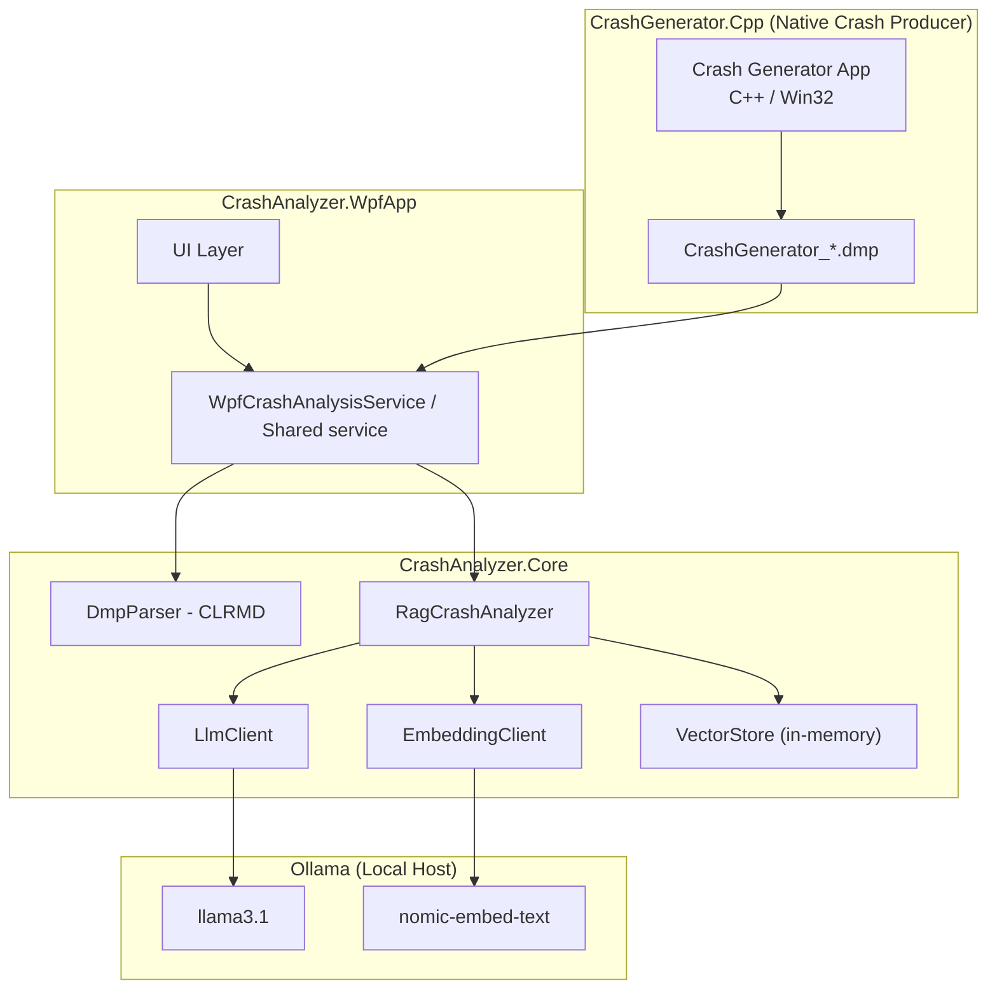

# CrashAnalizerSuite

CrashAnalizerSuite analyzes Windows crash dumps (`.dmp`) and supports prompt-based Q&A over crash data using a local LLM.

## Architecture



## LLM configuration used

From `crashanalyzer.settings.json`:

- **LLM host/base URL:** `http://localhost:11434`
- **LLM model:** `llama3.1`
- **Embedding model:** `nomic-embed-text`
- **Timeout:** `300` seconds

### Endpoints used by the app

- `GET /api/tags` - health check / reachability
- `POST /api/generate` - text generation for crash Q&A
- `POST /api/embeddings` - embedding generation for RAG retrieval

## How the app contacts the LLM

The app sends HTTP requests to Ollama at `LlmBaseUrl`.

Minimal C# endpoint connection examples:

```csharp
using var http = new HttpClient { BaseAddress = new Uri(settings.LlmBaseUrl) };
using var health = await http.GetAsync("/api/tags");
```

## Installation / setup

1. Install prerequisites:
   - Visual Studio 2026 (18.x) with:
     - .NET desktop workload
     - Desktop development with C++
   - .NET 10 SDK
   - Ollama

2. Pull required models:

   ```powershell
   ollama pull llama3.1
   ollama pull nomic-embed-text
   ```

3. Start Ollama service:

   ```powershell
   ollama serve
   ```

4. Verify/update `crashanalyzer.settings.json` in app output (or project) to match your environment:
   - `LlmBaseUrl`
   - `LlmModel`
   - `EmbeddingModel`
   - `SymbolizerPath`

## Recreate and run the solution

1. Open `CrashAnalizerSuite.slnx` in Visual Studio.
2. Build solution (`Build > Build Solution`).
3. Build and run **CrashGenerator.Cpp** in **Debug|x64** to generate test artifacts:
   - `.pdb` file from the Debug build
   - `.dmp` file generated after intentional crash (`CrashGenerator_*.dmp` in output folder)
4. Analyze the dump using the app:
   - Open `.dmp`
   - Open matching `.pdb`
   - Ask questions in the prompt area

## Notes

- RAG vector storage is in-memory and resets between sessions.
- The default host is local Ollama (`localhost:11434`); no cloud endpoint is required.
